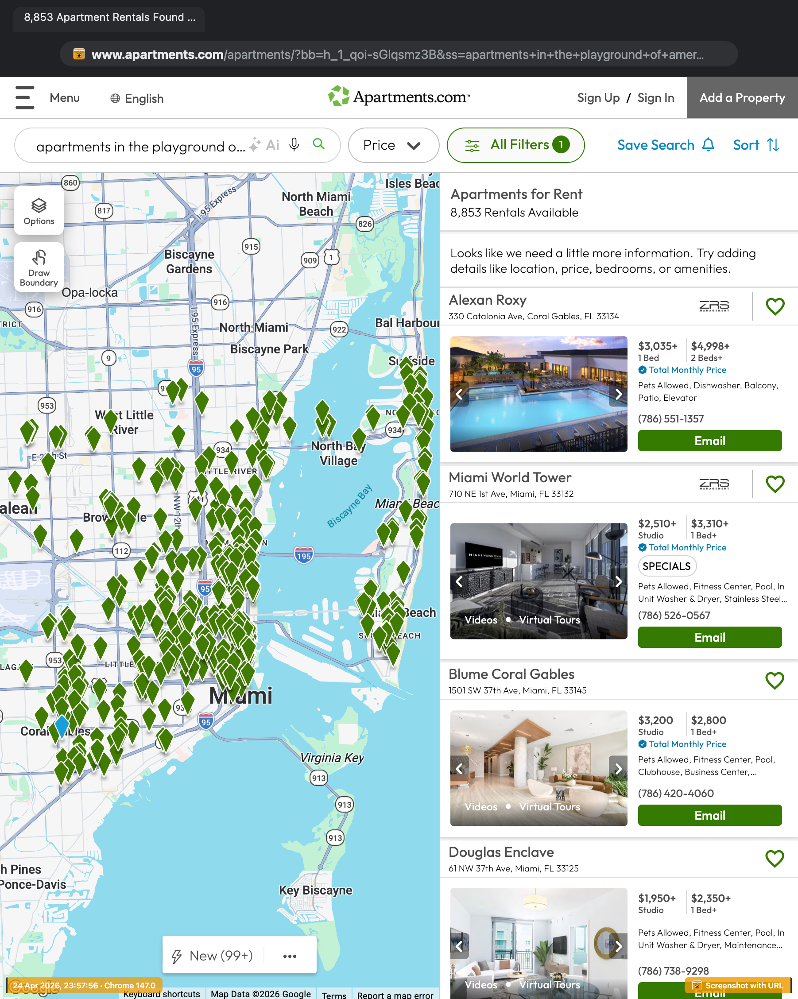
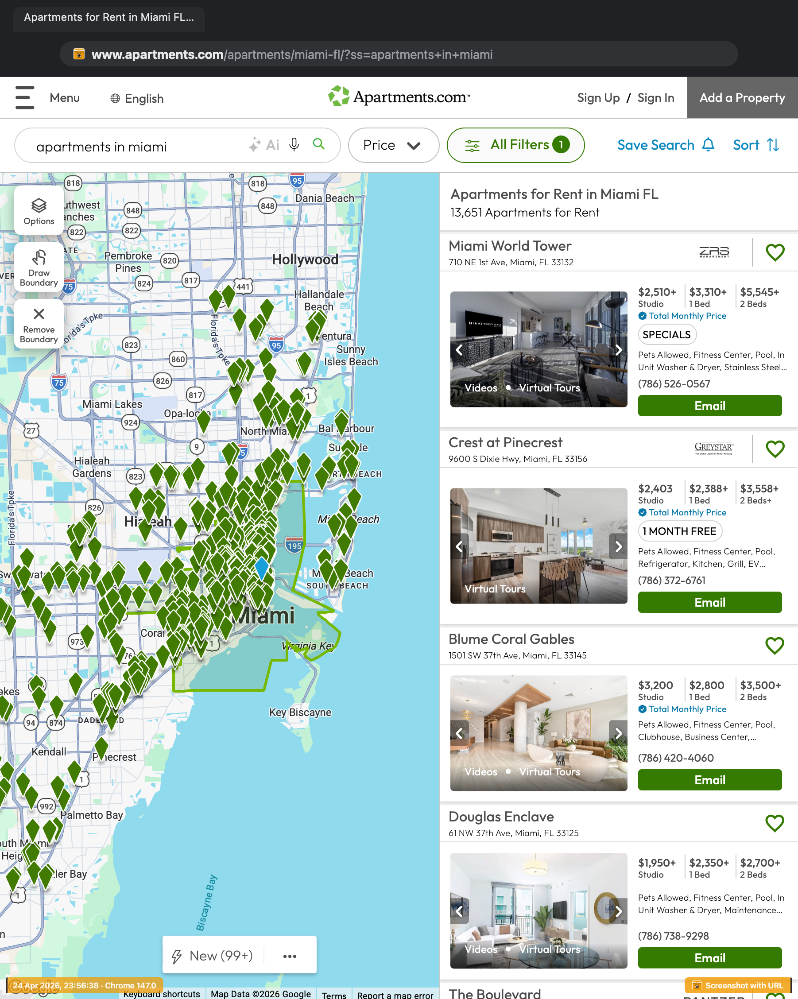
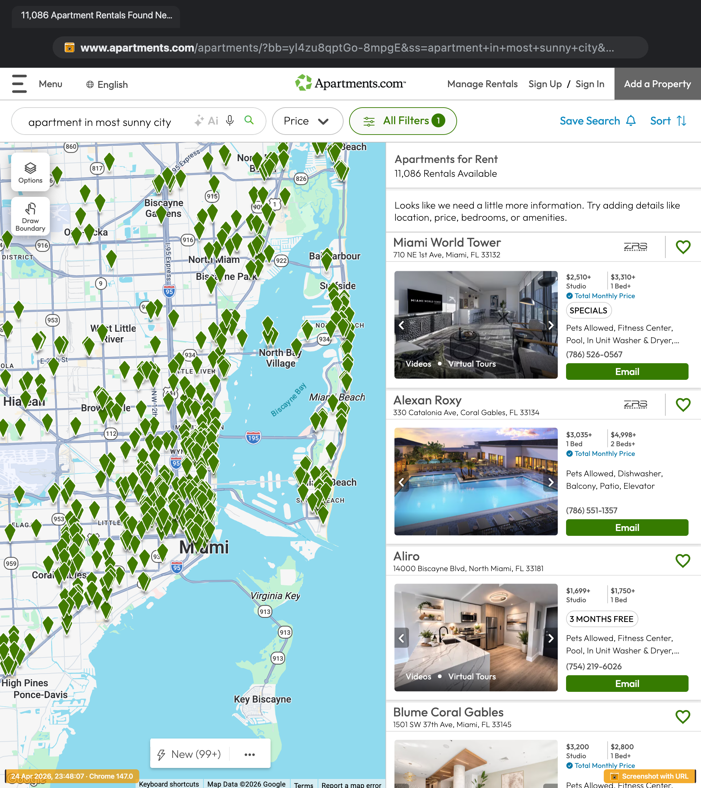
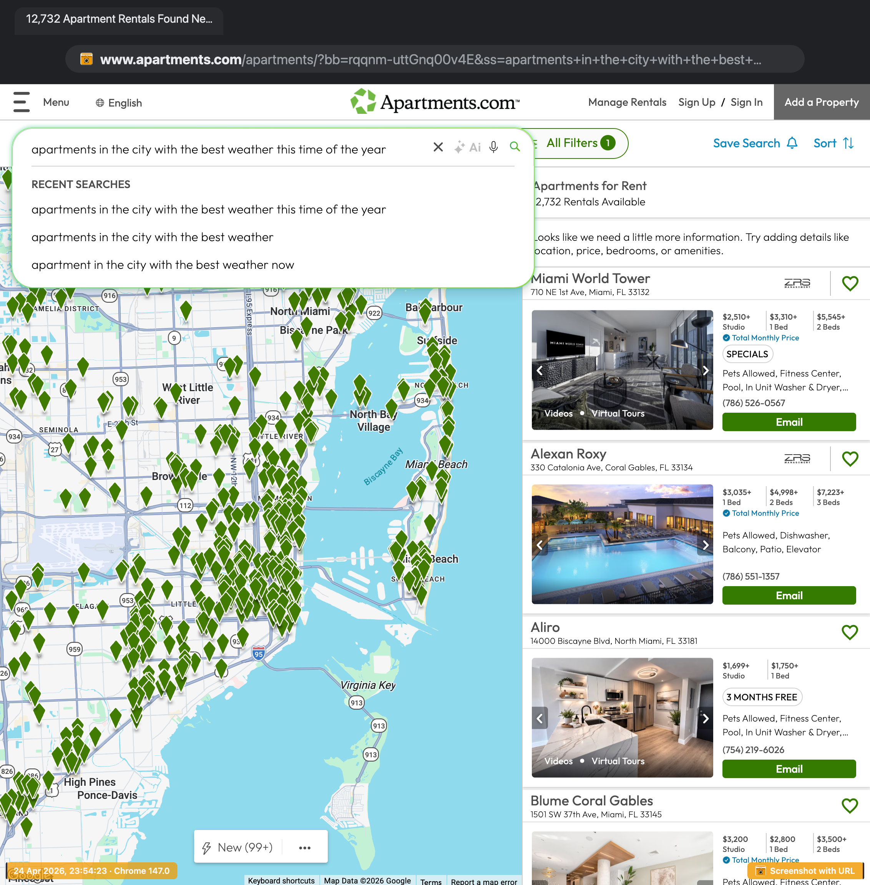
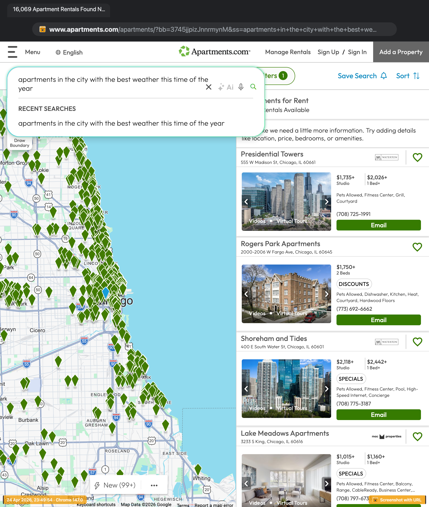

# LNGUI-Examples

Examples demonstrating UI scenarios for apartments.com smart search functionality with weather integration.

---

## Screenshot Index

| # | Screenshot | Description | 
|---|------------|-------------| 
| 1 | [America Playground](#1-playground---8k-listings) | "America's Playground" demo with ~8,000 apartment listings |
| 2 | [Miami - 16K Listings](#2-miami---16k-listings) | Miami market with ~16,000 apartment listings |
| 3 | [Most Sunny](#3-most-sunny) | Weather widget showing "most sunny" location |
| 4 | [Best Weather - In Place](#4-best-weather---in-place) | Best weather displayed inline in search results |
| 5 | [Best Weather - Now](#5-best-weather---now) | Current best weather conditions view | 

---

## Screenshots

### 1. America's Playground

**Description:** America's Playground demo showcasing approximately 8,000 apartment listings in Miami.

---

### 2. Miami - 16K Listings

**Description:** Search results for Miami displaying approximately 16,000 apartment listings.

---

### 3. Most Sunny

**Description:** Weather-focused search. Chicago is highlighted as the "most sunny" location !

---

### 4. Best Weather 

**Description:** Best weather conditions 

---

### 5. Best Weather - Now

**Description:** Best weather now - It was april 24, 2026

---

## Reference

Original API endpoint: `https://www.apartments.com/services/geography/smartsearch`